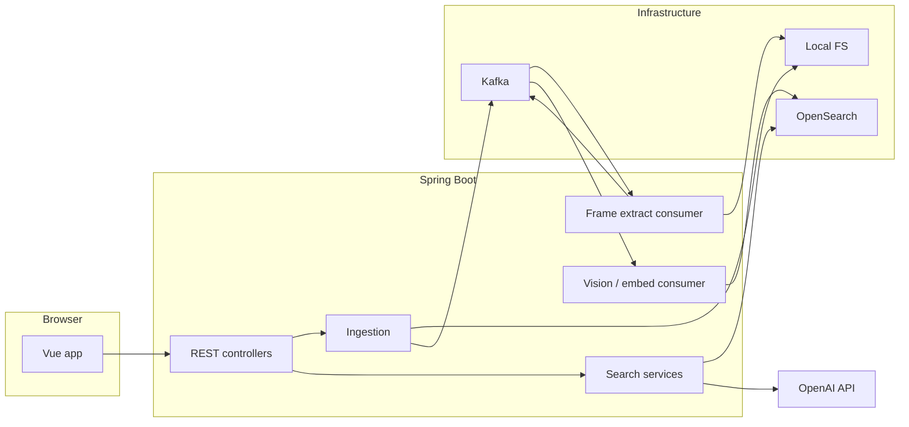

# VectraMoment — Semantic Video Intelligence Engine

## What this project is

VectraMoment is an end-to-end demo of **semantic video search**: you upload a video, the system extracts frames, describes them with vision AI, indexes them, and lets you find moments with **natural-language queries** (the “Time Machine” flow). Results link to timestamps so you can jump playback to the right instant.

It is built as a **portfolio-grade, locally runnable stack** (Docker + Spring Boot + Vue): event-driven processing, vector-capable search storage, and a deliberate **LLM-based matching** path for per-video search to reduce false negatives/positives from raw embedding thresholds alone.

## Features

- Multipart video upload with processing status (`queued` → `extracting` → `embedding` → `ready` / `failed`).
- Kafka-driven pipeline: ingest → frame extraction (~1 fps via JavaCV) → vision description + embeddings → OpenSearch indexing.
- Dashboard upload, Video.js playback, and Time Machine search scoped to a video or across the index.
- In-memory `/api/metrics` for local debugging (processing states, OpenAI retry/timeout counts).
- OpenAI API key supplied **only** per request (`X-OpenAI-Key`); not stored in server env or config files.

## Architecture

### Components

| Layer | Role |
|--------|------|
| **Frontend** (Vue 3, Vite, Tailwind, Pinia) | Upload UI, API key modal (memory-only store), Axios interceptor for `X-OpenAI-Key`, search and player. |
| **Backend** (Java 21, Spring Boot 3.4) | REST API, Kafka producers/consumers, frame extraction, OpenAI Vision + embeddings, OpenSearch client, local filesystem storage. |
| **Kafka** | Decouples ingestion from CPU-heavy extract/embed work; topics configurable per profile (e.g. `video.ingested.local` for `local`). |
| **OpenSearch** | Frame documents: descriptions, embeddings for k-NN, metadata for playback and filtering. |
| **Local storage** | Uploaded files and derived assets under a configurable directory (`target/vectramoment-uploads` locally, `/app/uploads` in Docker). |

### Data flow (high level)



### Search behaviour (summary)

- **With `videoId` (Time Machine, video selected):** frame descriptions for that video are loaded from OpenSearch and sent with the user query to the LLM; the model returns matching timestamps. This avoids brittle single-threshold vector behaviour for short queries on small corpora.
- **Without `videoId`:** embedding of the query + k-NN vector search in OpenSearch (requires `X-OpenAI-Key` for embedding).

Implementation touchpoints: `OpenAIVisionService.selectMatchingFrames()`, `OpenSearchVectorService.listFramesByVideoId()` / vector query paths, `SearchController`.

## Repository layout

```text
backend/          Spring Boot service (Maven)
frontend/         Vue 3 + Vite app
docker-compose.yml   Zookeeper, Kafka, OpenSearch, backend, frontend
start-all.ps1     Local dev: Docker then backend + frontend windows
```

## Stack

- **Backend:** Java 21, Spring Boot 3.4, Spring Kafka, JavaCV, OpenSearch Java client, WebFlux (OpenAI HTTP), Lombok, JUnit 5 / EmbeddedKafka / Testcontainers (tests).
- **Frontend:** Vue 3, Vite, Tailwind CSS, Pinia, Video.js, Axios.
- **Ops (local):** Docker Compose (Confluent Kafka 7.5, OpenSearch 2.11).

## Project status

Primary tested path: **local Docker stack** and **local profile** with Kafka + OpenSearch on the host or in Compose. AWS CDK and S3 were removed in favour of filesystem-backed storage for this repo’s scope.

## Quick start

### One command (PowerShell, project root)

```powershell
.\start-all.ps1
```

Starts Docker (Kafka, Zookeeper, OpenSearch), then backend (8081) and frontend (5173). Open **http://localhost:5173** and set the OpenAI key in the UI when prompted.

### Manual

```powershell
docker-compose up -d
cd backend; $env:SPRING_PROFILES_ACTIVE="local"; mvn spring-boot:run
cd frontend; npm run dev
```

### Full stack in Docker

```powershell
docker compose up -d --build
```

Frontend at **http://localhost:5173** (Nginx proxies `/api` to the backend). Backend uses `kafka:29092` and `opensearch:9200` on the Compose network.

**Kafka topic check (local profile):** e.g. `video.ingested.local` — use `kafka-console-consumer` against `localhost:9092` from the Kafka container.

### Demo flow

1. Open the app, set API key (**Update API Key**).
2. Upload a short clip (5–20s).
3. Wait for processing complete and frame count.
4. Try queries like `publish`, `warning`, `finger` with the video selected.
5. Click hits to seek the player.

## HTTP API (short reference)

| Method | Path | Notes |
|--------|------|--------|
| `POST` | `/api/videos/upload` | Multipart; optional `X-OpenAI-Key` |
| `GET` | `/api/videos/{videoId}/playback-url` | Local playback URL |
| `GET` | `/api/videos/{videoId}/processing-status` | State + `framesIndexed` + message |
| `GET` | `/api/search?q=...&videoId=...` | LLM match when `videoId` set; vector when omitted |
| `GET` | `/api/metrics` | In-memory counters (resets on restart) |

Default backend port: **8080** in base config; **8081** with `local` profile / Docker as used in Compose.

## Security (zero-trust for the OpenAI key)

- Controllers accept `X-OpenAI-Key` and pass it transiently to services; do not put keys in `.env`, `application.yml`, or server environment for production-style handling of user keys.
- Frontend: Pinia store (memory) + Axios interceptor on outgoing API calls.

## Technical assumptions

- OpenAI key per request; not persisted server-side.
- ~1 frame per second extraction: cost and latency scale roughly linearly with duration.
- Local OpenSearch/Kafka are single-node dev topology.
- `/api/metrics` and processing status are best-effort for local ops (not durable analytics; restart can lose in-memory state).

## Known limitations (current scope)

- Long videos: many frames → more vision/API work.
- Heavy parallel uploads: retries exist; queue backpressure is not fully modeled.
- Primarily validated on local / Compose paths.

## Future scope

Near-term improvements that fit the existing architecture:

- **Resilience:** bounded concurrency, backpressure, and clearer queue semantics for bursts of uploads.
- **Observability:** structured logging, tracing, and optional metrics export instead of only in-memory counters.
- **Search:** tunable hybrid retrieval (e.g. vector shortlist + LLM rerank), optional caching of embeddings per frame version.
- **Product:** user accounts and server-side auth if keys move off pure client-supplied headers; object storage and managed OpenSearch for a hosted deployment.

Larger stretch goals: multi-tenant isolation, regional deployment, and cost controls (batching vision calls, lower fps modes).

## Tests

```bash
cd backend && mvn test
```

- `VideoUploadIT` — upload controller validation (e.g. empty file rejected).
- `KafkaOpenSearchPipelineIT` — Kafka integration with EmbeddedKafka.

## License

See [LICENSE](LICENSE) in the repository (MIT).
